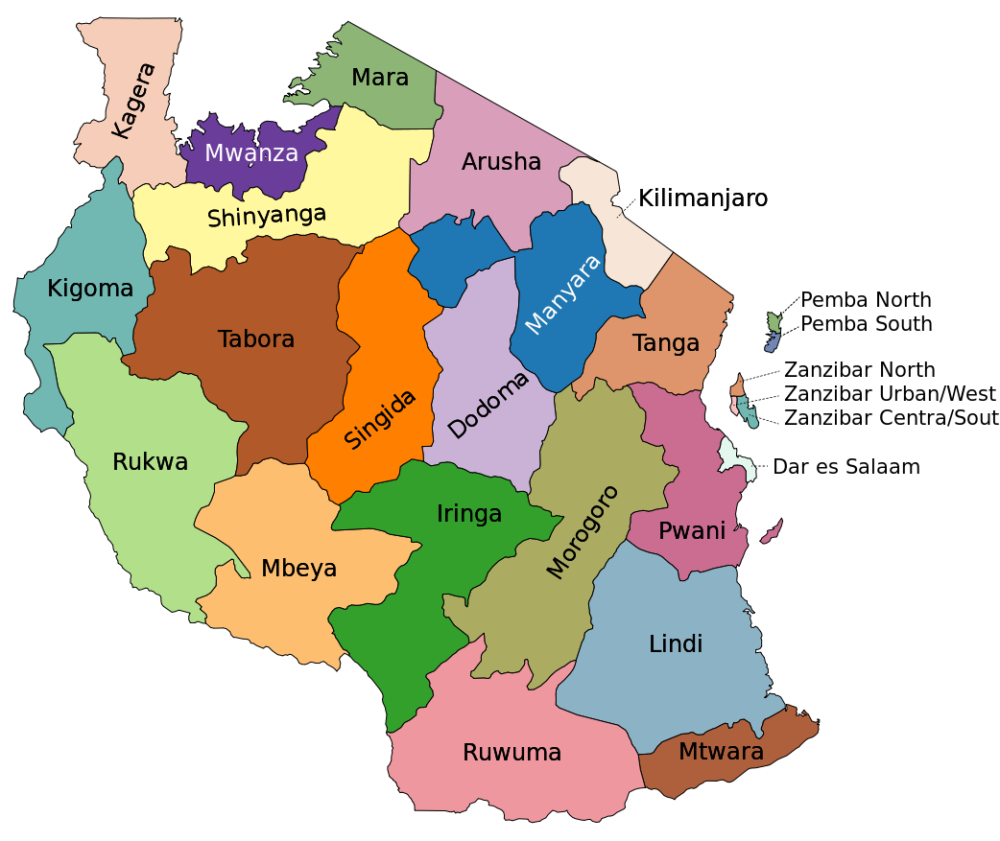

```{r setup-layout, cache=FALSE, echo=FALSE}
# Define the report layout.
library(knitr)

# Set global chunk options: images sizes for html and docx
output <- opts_knit$get("rmarkdown.pandoc.to")

if (output=="html") opts_chunk$set(fig.width=10,  fig.height=6)
if (output=="docx") opts_chunk$set(fig.width=10,  fig.height=6)

# Set the printable width
options(width = 95)
```
\newline


# Setup
Set the working directory, clear all existing objects in the workspace and set the seed for reproducibility.  Lastly, load the necessary libraries.
```{r env-config, warning=FALSE, message=FALSE}
# Set the working directory
setwd("./")

# Clear all existing objects in the workspace
rm(list = ls())

# Set the seed for reproducible results
set.seed(1009)

# Load libraries
library(dplyr)
library(ggplot2)
library(ggmap)
library(scales)
library(RColorBrewer)
```
\newline


# Attribute Definitions:
* id - Well identifier
* amount_tsh - Total static head (amount water available to waterpoint)
* date_recorded - The date the row was entered
* funder - Who funded the well
* gps_height - Altitude of the well
* installer - Organization that installed the well
* longitude - GPS coordinate
* latitude - GPS coordinate
* wpt_name - Name of the waterpoint if there is one
* num_private -
* basin - Geographic water basin
* subvillage - Geographic location
* region - Geographic location
* region_code - Geographic location (coded)
* district_code - Geographic location (coded)
* lga - Geographic location
* ward - Geographic location
* population - Population around the well
* public_meeting - True/False
* recorded_by - Group entering this row of data
* scheme_management - Who operates the waterpoint
* scheme_name - Who operates the waterpoint
* permit - If the waterpoint is permitted
* construction_year - Year the waterpoint was constructed
* extraction_type - The kind of extraction the waterpoint uses
* extraction_type_group - The kind of extraction the waterpoint uses
* extraction_type_class - The kind of extraction the waterpoint uses
* management - How the waterpoint is managed
* management_group - How the waterpoint is managed
* payment - What the water costs
* payment_type - What the water costs
* water_quality - The quality of the water
* quality_group - The quality of the water
* quantity - The quantity of water
* quantity_group - The quantity of water
* source - The source of the water
* source_type - The source of the water
* source_class - The source of the water
* waterpoint_type - The kind of waterpoint
* waterpoint_type_group - The kind of waterpoint
* status_group - The operational status of the well
    + functional - the waterpoint is operational and there are no repairs needed
    + functional needs repair - the waterpoint is operational, but needs repairs
    + non functional - the waterpoint is not operational

\newline


# Load the Datasets
```{r load-data, cache=TRUE}
train.values <- read.csv("../data/clean-training-set-values.csv", header = TRUE, na.strings = "NA")
train.values$population[train.values$population == 0] <- NA
train.labels <- read.csv("../data/src-training-set-labels.csv", header = TRUE)
```
\newline


# Analysis
For the analysis, the training values and labels will be merged, and the exploration will be conducted on the combined dataset.
## Merge the training values and labels
```{r merge-datasets}
training.data <- merge(train.values, train.labels)
```
\newline


## View the Summary Statistics
The following variables contain missing values:

* funder - 4,414
* installer - 4,435
* wpt_name - 3,565
* subvillage - 371
* scheme_management - 3,877
* scheme_name - 28,166
* construction_year - 20,709

```{r summary-stats}
summary(training.data)
```
\newline


## Visualize Pumps in Tanzania
To begin, pump locations are plotted on a map to get a sense of where they are located and determine if they are clustered in certain parts of the country.  The pumps, regardless of status, are generally located in the same areas.  Although, the Southern tip of Tanzania shows a higher concentration of non-functional pumps.
```{r  map, warning=FALSE, fig.width=12, fig.height=8, cache=TRUE}
# Center of Tanzania
map <- get_map(c(lon = 34.888822, lat = -6.369028), source = "google", zoom = 6)

ggmap(map) + 
  geom_point(aes(x = longitude, y = latitude, colour = status_group), data = training.data, alpha = 1/2) +
  scale_colour_brewer(palette = "Set1", name = "Status Group")
```
\newline


## Pump Status Distribution
An inspection of the pump status group shows that just over half of the water pumps are operational at 54.3%.
```{r pump-status}
ggplot(data=training.data, aes(x=status_group)) + 
    geom_bar(aes(y = (..count..)/sum(..count..)), fill=brewer.pal(3, "Set1"), alpha = 1/2) + 
    geom_text(aes(y = ((..count..)/sum(..count..)), label = scales::percent((..count..)/sum(..count..))), 
              stat = "count", vjust = -0.25) +
    scale_y_continuous(labels = percent) +
    theme(axis.text.y=element_blank(), axis.ticks=element_blank(), axis.title.y=element_blank()) +
    theme(plot.title = element_text(hjust = 0.5, face="bold")) +
    xlab("Operational Status") + ylab("Percent")
```
\newline


## Inspect Categorical Variables
The next few plots compare categorical variables by pump status groups.

### Basins
Ploting the water pumps by basin and separating them by status shows that the Pangani basin has the most functional water pumps.  The Lake Victoria basin has the highest quantity of water pumps that require repair or are not functional.  In addition, Lake Rukwa, Lake Tanganyika, and Ruvuma / Southern Coast have more non-functional pumps than functional pumps.
```{r basin-plot}
ggplot(training.data, aes(x=basin, fill = basin)) + geom_bar(alpha = 1/2) + 
  scale_fill_brewer(palette="Set1") + facet_grid(~status_group) +
  theme(axis.text.x=element_text(angle = -45, hjust = 0)) +
  xlab("") + ylab("Pump Count") + guides(fill=guide_legend(title="Basin"))
```
\newline


### Regions
Comparing the region plot to the region map illustrates that regions where the quantity of non-functional pumps exceed functional pumps are not clustered in a specific part of the country.  These regions include Lindi, Mara, Mtwara, Rukwa, and Tabora.

```{r region-plot}
ggplot(training.data, aes(x=region, fill = status_group)) + 
  geom_bar(alpha = 1/2) + scale_fill_brewer(palette="Set1") +
  theme(axis.text.x=element_text(angle = -45, hjust = 0)) +
  xlab("") + ylab("Pump Count") + guides(fill=guide_legend(title="Status Group"))
```

*Figure 1*. Tanzania region map. Reprinted from Tanzania regions (para. 1).
\newline


### Permit
A potential hypothesis is that pumps without permits may not be built to the required standards, and therefore may have a higher amount of pumps needing repair or that are non-funtional.  However, at the following plot depicts, for each pump status group, permitted pumps outnumber non-permitted pumps.
```{r permit-plot}
# Filter out observations with NA
permits <- training.data %>% select(permit, status_group) %>%
              filter(! is.na(permit))

ggplot(permits, aes(x=permit, fill = permit)) + geom_bar(alpha = 1/2) + 
  scale_fill_brewer(palette="Set1") + facet_grid(~status_group) +
  theme(axis.text.x=element_text(angle = -45, hjust = 0)) +
  xlab("") + ylab("Pump Count") + guides(fill=guide_legend(title="Permit"))
```
\newline


### Extraction Type Class
Could the pump extraction type class contribute to the pump status group?  As exhibited in the following plot, gravity and handpump extraction have a significantly higher level of functional pumps. In contrast, extraction types of motorpump and other cleary are less reliable.
```{r extract-class-plot}
ggplot(training.data, aes(x=extraction_type_class, fill = extraction_type_class)) + 
  geom_bar(alpha = 1/2) + scale_fill_brewer(palette="Set1") + facet_grid(~status_group) +
  theme(axis.text.x=element_text(angle = -45, hjust = 0)) +
  xlab("") + ylab("Pump Count") + guides(fill=guide_legend(title="Extraction Type Class"))
```
\newline


### Water Quality Group
Is there a relationship between the water quality group and pump status?  The following plot demonstrates that the overwhelming majority of pumps are classified as having good water.  Only in the case of the water quality group of "unknown", are there more non-fuctional pumps than functional pumps.
```{r quality-group-plot}
ggplot(training.data, aes(x=quality_group, fill = quality_group)) + 
  geom_bar(alpha = 1/2) + scale_fill_brewer(palette="Set1") + facet_grid(~status_group) +
  theme(axis.text.x=element_text(angle = -45, hjust = 0)) +
  xlab("") + ylab("Pump Count") + guides(fill=guide_legend(title="Water Quality"))
```
\newline


### Water Quantity
The quantity of water available to a pump, or the lack thereof, could render a pump non-functional.  As the following plot demonstrates, pumps where the water quantity category is dry, have the lowest level of functional pumps.
```{r quantity-group-plot}
ggplot(training.data, aes(x=quantity, fill = quantity)) + 
  geom_bar(alpha = 1/2) + scale_fill_brewer(palette="Set1") + facet_grid(~status_group) +
  theme(axis.text.x=element_text(angle = -45, hjust = 0)) +
  xlab("") + ylab("Pump Count") + guides(fill=guide_legend(title="Water Quantity"))
```
\newline


### Water Source
A visual inspection of the water source shows that spring and shallow well account for the majority of water sources.  In addition, upon visual inspection, both categories have the most functional and non-functional pumps.
```{r source-plot}
# Extend the Set1 palette
#set1.plus1 <- colorRampPalette(brewer.pal(9, "Set1"))(10)

# ggplot(training.data, aes(x=source, fill = source)) + 
#   geom_bar(alpha = 1/2) + scale_fill_manual(values = set1.plus1) + facet_grid(~status_group) +
#   theme(axis.text.x=element_text(angle = -45, hjust = 0)) +
#   xlab("") + ylab("Pump Count") + guides(fill=guide_legend(title="Water Source"))

ggplot(training.data, aes(x=source, fill = status_group)) + 
  geom_bar(alpha = 1/2) + scale_fill_brewer(palette="Set1") +
  theme(axis.text.x=element_text(angle = -45, hjust = 0)) +
  xlab("") + ylab("Pump Count") + guides(fill=guide_legend(title="Status Group"))
```
\newline


### Water Point Type
Examining the water point types provide a discernible majority in the communal standpipe and hand pump categories.  Across all categories, only communal standpipe multiple and other have more non-functional pumps compared to functional pumps.
```{r wtr-point-type-plot}
ggplot(training.data, aes(x=waterpoint_type, fill = waterpoint_type)) + 
  geom_bar(alpha = 1/2) + scale_fill_brewer(palette="Set1") + facet_grid(~status_group) +
  theme(axis.text.x=element_text(angle = -45, hjust = 0)) +
  xlab("") + ylab("Pump Count") + guides(fill=guide_legend(title="Water Point Type"))
```
\newline


## Inspect Continuous and Discrete Variables
The next few plots compare continuous and discrete variables by pump status groups.


### Population
The popoluation attribute only contains 39,019 (64.0%) observations with a value greater than zero.  In addition the data is signifcantly skewed.  Taking the natural log of the population aids in correcting the skew into a somewhat normal bell shape.  Future iterations will address options for the observations containing zero.
```{r population-plot}
# Filter out observations with NA
population <- training.data %>% select(population, status_group) %>%
              filter(! is.na(population))
dim(population)

ggplot(population, aes(x = log(population))) + 
  geom_histogram(bins = 30, fill="#377EB8", alpha = 1/2) +
  facet_grid( ~ status_group) + xlab("Population") + ylab("")
```
\newlines


### Total Static Head Amount (amount water available to waterpoint)
The total static head amount variable also contains highly skewed value and a large amount of outliers.
```{r amount_tsh-plot}
ggplot(training.data, aes(x=status_group, y=amount_tsh)) + 
  geom_boxplot(fill="#377EB8") + coord_flip() + xlab("") + ylab("")
```
\newline


### Construction Year
Each pump status displays a left-skewed histogram.  Logically, this is reasonable since more pumps will exist over time as populations increase.
```{r construction-yr-plot}
# Filter out observations with NA
constr.year <- training.data %>% select(construction_year, status_group) %>%
              filter(! is.na(construction_year))

ggplot(constr.year, aes(x = construction_year)) + 
  geom_histogram(bins = 20, fill="#377EB8", alpha = 1/2) +
  facet_grid( ~ status_group) + xlab("Year") + ylab("")
```
\newline


### GPS Height

```{r gps-height-plot}
ggplot(training.data, aes(x = gps_height)) + 
  geom_histogram(bins = 30, fill="#377EB8", alpha = 1/2) +
  facet_grid( ~ status_group) + xlab("Height") + ylab("")
```
\newlines


# References
Wikimedia Commons. (2012). Tanzania regions. Retrieved from https://commons.wikimedia.org/wiki/File:Tanzania_regions.svg

